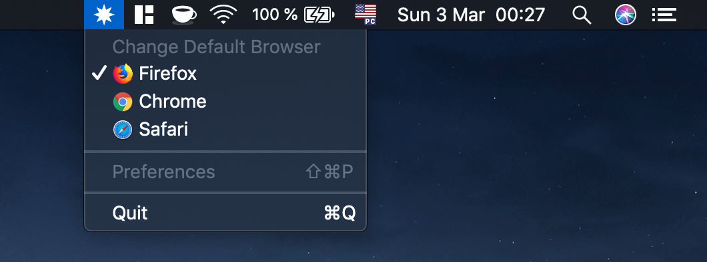

#  Plew

The fastest way to change your default browser on MacOS

## Screenshot

## Installation
:warning: Plew was created in one day without any previous experience with development for MacOS
1. [Download the latest version of Plew](https://github.com/slowbackspace/Plew/releases).
2. Unzip the archive and move `Plew.app` to `/Applications`

## Roadmap
- [ ] Figure out a better way to automatically close confirmation dialog
- [ ]  Change the browser based on time of day, wifi networks,... 

## Credits
- Thanks to all genius people on StackOverflow and [@cho45](https://gist.github.com/cho45/ac9443aaa66406408485)
